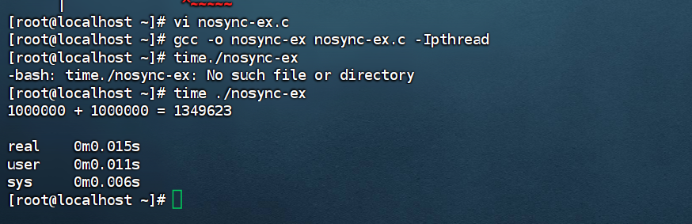

```markdown
# 多线程代码记录

## 一、概述  
本次记录包含三个多线程相关的 C 语言代码文件，分别是 `nosync-ex.c`、`sem-ex.c` 和 `mutex-ex.c`。这些代码的核心目的是创建两个线程，每个线程对全局变量 `sum` 进行 1000000 次加 1 操作，不同之处在于同步机制的使用。

---

## 二、`nosync-ex.c` 代码分析

### 1. 代码功能  
此代码在多线程环境下对全局变量 `sum` 进行累加操作，但未使用任何同步机制，可能会出现数据竞争问题。

### 2. 源码  
```c
#include<stdio.h>
#include<pthread.h>

int sum = 0;
void *thread(void *arg){
    int i;
    for(i = 0; i < 1000000; i++){
        sum +=1;
    }
}
int main(){
    pthread_t tid1,tid2;
    pthread_create(&tid1,NULL,thread,NULL);
    pthread_create(&tid2,NULL,thread,NULL);
    pthread_join(tid1,NULL);
    pthread_join(tid2,NULL);
    printf("1000000 + 1000000 = %d\n",sum);
    return 0;
}
```
 )
### 3. 代码解释  
- **全局变量 `sum`**：用于存储两个线程累加的结果。  
- **`thread` 函数**：每个线程执行该函数，对 `sum` 进行 1000000 次加 1 操作。  
- **`main` 函数**：创建两个线程并等待它们执行完毕，最后输出 `sum` 的值。  

### 4. 存在问题  
由于没有同步机制，多个线程可能同时访问和修改 `sum` 变量，导致最终结果小于 2000000。

---

## 三、`sem-ex.c` 代码分析

### 1. 代码功能  
该代码使用信号量 `sem` 来实现线程同步，确保同一时间只有一个线程可以访问 `sum` 变量。

### 2. 源码  
```c
#include<stdio.h>
#include<pthread.h>
#include<semaphore.h>
int sum = 0;
sem_t sem;
void *thread(void *arg){
    int i;
    for(i = 0; i < 1000000; i++){
        sem_wait(&sem);
        sum +=1;
        sem_post(&sem);
    }
}
int main(){
    pthread_t tid1,tid2;
    sem_init(&sem,0,1);
    pthread_create(&tid1,NULL,thread,NULL);
    pthread_create(&tid2,NULL,thread,NULL);
    pthread_join(tid1,NULL);
    pthread_join(tid2,NULL);
    printf("1000000 + 1000000 = %d\n",sum);
    return 0;
}
```

### 3. 代码解释  
- **全局变量 `sum` 和 `sem`**：`sum` 用于存储累加结果，`sem` 是信号量，用于线程同步。  
- **`thread` 函数**：每个线程执行该函数，在对 `sum` 进行加 1 操作前调用 `sem_wait` 获取信号量，操作完成后调用 `sem_post` 释放信号量。  
- **`main` 函数**：初始化信号量，创建两个线程并等待它们执行完毕，最后输出 `sum` 的值。  

### 4. 优点  
通过信号量机制，避免了数据竞争问题，保证了最终结果的正确性。

---

## 四、`mutex-ex.c` 代码分析

### 1. 代码功能  
此代码使用互斥锁 `mutex` 来实现线程同步，确保同一时间只有一个线程可以访问 `sum` 变量。

### 2. 源码  
```c
#include<stdio.h>
#include<pthread.h>

int sum = 0;
pthread_mutex_t mutex;
void *thread(void *arg){
    int i;
    for(i = 0; i < 1000000; i++){
        pthread_mutex_lock(&mutex);
        sum +=1;
        pthread_mutex_unlock(&mutex);
    }
}
int main(){
    pthread_t tid1,tid2;
    pthread_mutex_init(&mutex,NULL);
    pthread_create(&tid1,NULL,thread,NULL);
    pthread_create(&tid2,NULL,thread,NULL);
    pthread_join(tid1,NULL);
    pthread_join(tid2,NULL);
    printf("1000000 + 1000000 = %d\n",sum);
    return 0;
}
```

### 3. 代码解释  
- **全局变量 `sum` 和 `mutex`**：`sum` 用于存储累加结果，`mutex` 是互斥锁，用于线程同步。  
- **`thread` 函数**：每个线程执行该函数，在对 `sum` 进行加 1 操作前调用 `pthread_mutex_lock` 获取互斥锁，操作完成后调用 `pthread_mutex_unlock` 释放互斥锁。  
- **`main` 函数**：初始化互斥锁，创建两个线程并等待它们执行完毕，最后输出 `sum` 的值。  

### 4. 优点  
使用互斥锁可以有效地保护共享资源，避免数据竞争，保证最终结果的正确性。

---

## 五、总结  
- **`nosync-ex.c`**：未使用同步机制，会出现数据竞争问题，导致结果不准确，不适合多线程环境。  
- **`sem-ex.c`**：通过信号量实现同步，结果正确但性能略低于互斥锁。  
- **`mutex-ex.c`**：通过互斥锁实现同步，既能保证结果正确性，又具有较高的性能。  
在实际开发中，应根据具体场景选择合适的同步机制。  
```