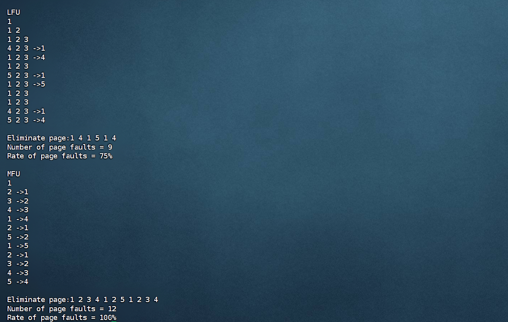
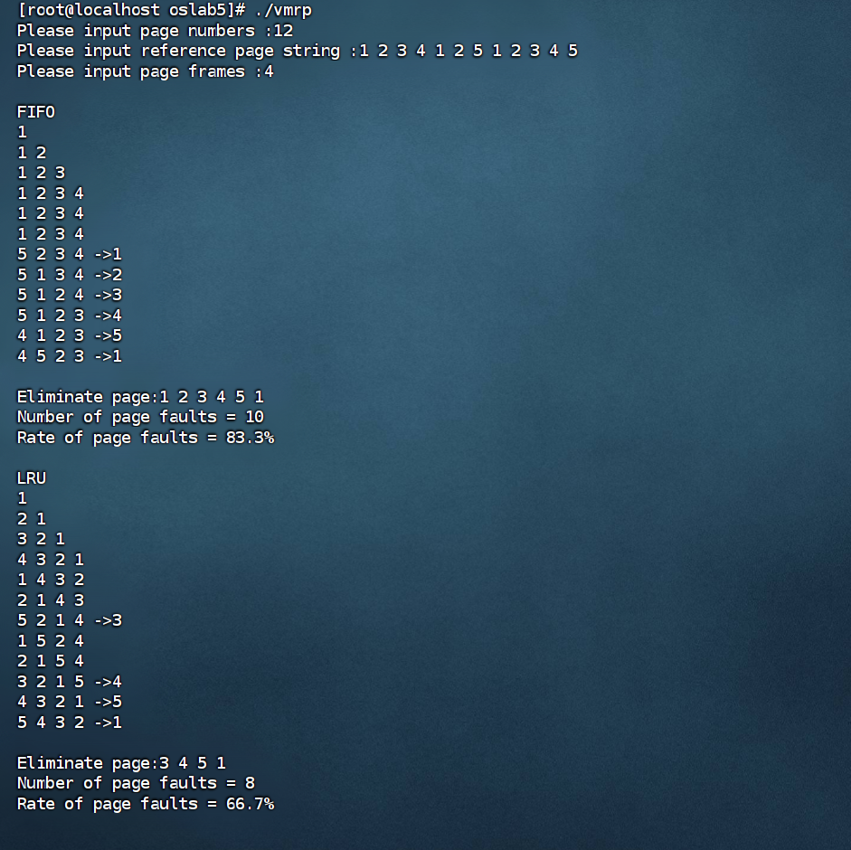
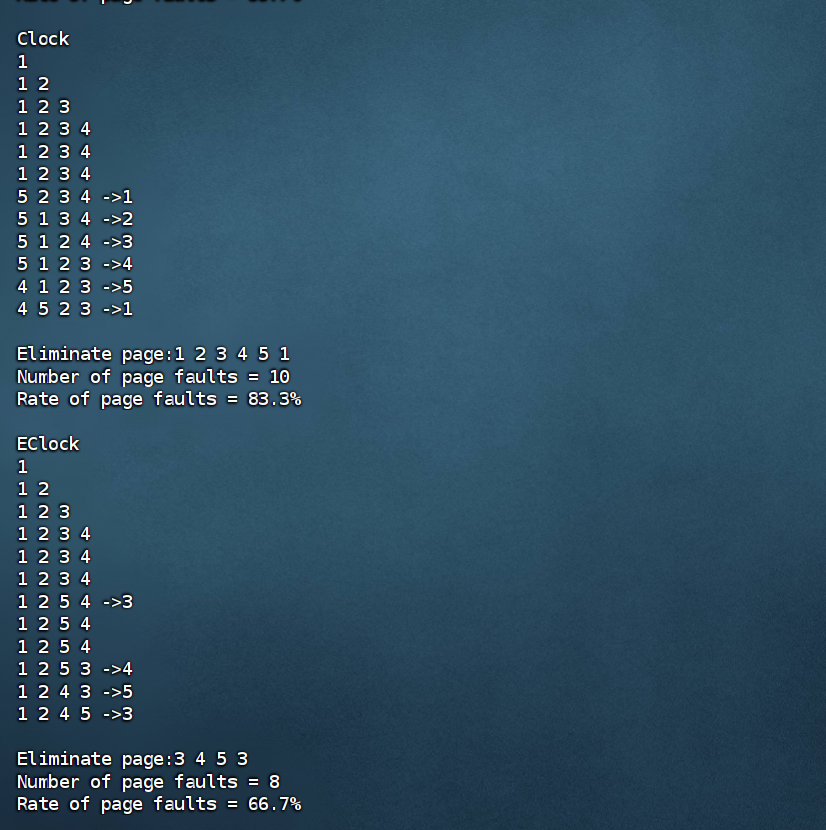
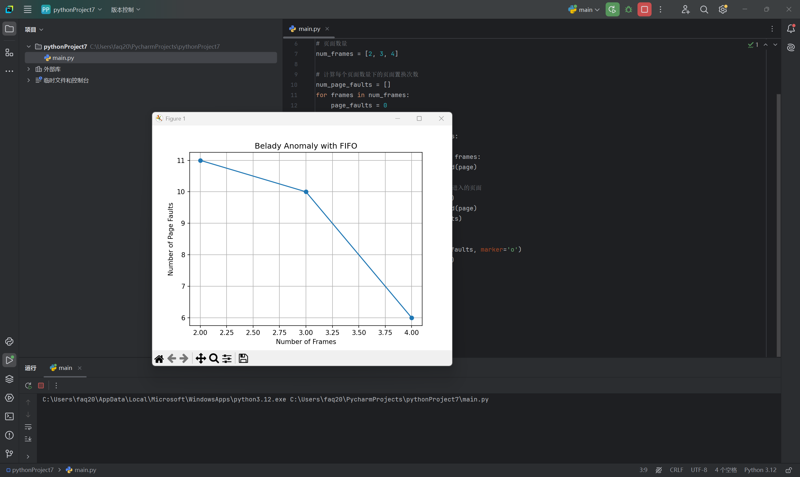

#  实验七 、内存页面置换算法实验
## 1.代码实现
```c
    #include "vmrp.h"
    Replace::Replace() {
        int i;  // 设定总得访问页数,并分配相应的引用页号和淘汰页号记录数组空间
        cout << "Please input page numbers :";
        cin >> PageNumber;
        ReferencePage = new int[sizeof(int) * PageNumber];
        EliminatePage = new int[sizeof(int) * PageNumber];
        // 输入引用页号序列(页面走向), 初始化引用页数组cout
        cout << "Please input reference page string :";
        for (i = 0; i < PageNumber; i++)
            cin >> ReferencePage[i];  // 引用页暂存引用数组
        // 设定内存实页数(帧数),并分配相应的实页号记录数组空间(页号栈)
        cout << "Please input page frames :";
        cin >> FrameNumber;
        PageFrames = new int[sizeof(int) * FrameNumber];
    }
    Replace::~Replace() {}
    void Replace::InitSpace(char* MethodName) {
        int i;
        cout << endl << MethodName << endl;
        FaultNumber = 0;
        // 引用还未开始,-1 表示无引用页
        for (i = 0; i < PageNumber; i++)
            EliminatePage[i] = -1;
        for (i = 0; i < FrameNumber; i++)
            PageFrames[i] = -1;
    }
    void Replace::Report(void) {
        // 报告淘汰页顺序
        cout << endl << "Eliminate page:";
        for (int i = 0; EliminatePage[i] != -1; i++)
            cout << EliminatePage[i] << " ";
        // 报告缺页数和缺页率
        cout << endl << "Number of page faults = " << FaultNumber << endl;
        cout << setw(6) << setprecision(3);
        cout << "Rate of page faults = "
            << 100 * (float)FaultNumber / (float)PageNumber << "%" << endl;
    }
    void Replace::Lru(void) {
        int i, j, k, l, next;
        InitSpace("LRU");
        for (k = 0, l = 0; k < PageNumber; k++) {
            next = ReferencePage[k];
            // 检测引用页当前是否已在实存
            for (i = 0; i < FrameNumber; i++) {
                if (next == PageFrames[i]) {
                    // 引用页已在实存将其调整到页记录栈顶
                    next = PageFrames[i];
                    for (j = i; j > 0; j--)
                        PageFrames[j] = PageFrames[j - 1];
                    PageFrames[0] = next;
                    break;
                }
            }
            if (PageFrames[0] == next) {
                // 如果引用页已放栈顶，则为不缺页，报告当前内存页号
                for (j = 0; j < FrameNumber; j++)
                    if (PageFrames[j] >= 0)
                        cout << PageFrames[j] << " ";
                cout << endl;
                continue;
            } else
                // 如果引用页还未放栈顶，则为缺页，缺页数加1
                FaultNumber++;
            // 栈底页号记入淘汰页数组中
            EliminatePage[l] = PageFrames[FrameNumber - 1];
            // 向下压栈
            for (j = FrameNumber - 1; j > 0; j--)
                PageFrames[j] = PageFrames[j - 1];
            PageFrames[0] = next;  // 引|用页放栈顶
            // 报告当前实存中页号
            for (j = 0; j < FrameNumber; j++)
                if (PageFrames[j] >= 0)
                    cout << PageFrames[j] << " ";
            // 报告当前淘汰的页号
            if (EliminatePage[l] >= 0)
                cout << "->" << EliminatePage[l++] << endl;
            else
                cout << endl;
        }
        // 分析统计选择的算法对于当前引用的页面走向的性能
        Report();
    }
    void Replace::Fifo(void) {
        int i, j, k, l, next;
        InitSpace("FIFO");
        // 循环装入引用页
        for (k = 0, j = l = 0; k < PageNumber; k++) {
            next = ReferencePage[k];
            // 如果引用页已在实存中，报告实存页号
            for (i = 0; i < FrameNumber; i++)
                if (next == PageFrames[i])
                    break;
            if (i < FrameNumber) {
                for (i = 0; i < FrameNumber; i++)
                    cout << PageFrames[i] << " ";
                cout << endl;
                continue;
            }
            // 引用页不在实存中，缺页数加1
            FaultNumber++;
            EliminatePage[l] = PageFrames[j];
            // 最先入页号记入淘汰页数组
            PageFrames[j] = next;       // 引用页号放最先入页号处
            j = (j + 1) % FrameNumber;  // 最先入页号循环下移
            // 报告当前实存页号和淘汰页号
            for (i = 0; i < FrameNumber; i++)
                if (PageFrames[i] >= 0)
                    cout << PageFrames[i] << " ";
            if (EliminatePage[l] >= 0)
                cout << "->" << EliminatePage[l++] << endl;
            else
                cout << endl;
        }
        // 分析统计选择的算法对于当前引用的页面走向的性能
        Report();
    }

    void Replace::Clock(void) {
        InitSpace("Clock");
        int pointer = 0;                     // 指向下一个要替换的页面
        bool* used = new bool[FrameNumber];  // 用于记录页面是否被访问过
        int eliminateIndex = 0;              // 用于记录淘汰页的索引

        for (int i = 0; i < FrameNumber; i++) {
            used[i] = false;
        }

        for (int k = 0; k < PageNumber; k++) {
            int next = ReferencePage[k];
            bool found = false;

            // 检查页面是否在帧中
            for (int i = 0; i < FrameNumber; i++) {
                if (PageFrames[i] == next) {
                    found = true;
                    used[i] = true;  // 将页面标记为已访问
                    break;
                }
            }

            if (!found) {
                FaultNumber++;
                // 找到一个没有被访问过的页面进行替换
                while (used[pointer]) {
                    used[pointer] = false;
                    pointer = (pointer + 1) % FrameNumber;
                }

                // 记录被淘汰的页面
                if (PageFrames[pointer] != -1) {
                    EliminatePage[eliminateIndex++] = PageFrames[pointer];
                }

                // 进行页面替换
                PageFrames[pointer] = next;
                used[pointer] = true;
                pointer = (pointer + 1) % FrameNumber;
            }

            // 报告当前实存中页号
            for (int j = 0; j < FrameNumber; j++) {
                if (PageFrames[j] >= 0)
                    cout << PageFrames[j] << " ";
            }
            if (!found && eliminateIndex > 0 &&
                EliminatePage[eliminateIndex - 1] > 0)
                cout << "->" << EliminatePage[eliminateIndex - 1] << endl;
            else
                cout << endl;
        }

        delete[] used;
        Report();
    }

    void Replace::Eclock(void) {
        InitSpace("EClock");
        int pointer = 0;                     // 指向下一个要替换的页面
        bool* used = new bool[FrameNumber];  // 用于记录页面是否被访问过
        bool* modified = new bool[FrameNumber];  // 用于记录页面是否被修改过
        int eliminateIndex = 0;                  // 用于记录淘汰页的索引

        for (int i = 0; i < FrameNumber; i++) {
            used[i] = false;
            modified[i] = false;
        }

        for (int k = 0; k < PageNumber; k++) {
            int next = ReferencePage[k];
            bool found = false;

            // 检查页面是否在帧中
            for (int i = 0; i < FrameNumber; i++) {
                if (PageFrames[i] == next) {
                    found = true;
                    used[i] = true;      // 将页面标记为已访问
                    modified[i] = true;  // 假设页面被访问时也被修改
                    break;
                }
            }

            if (!found) {
                FaultNumber++;
                // 找到一个没有被访问过的页面进行替换
                while (used[pointer] || modified[pointer]) {
                    if (used[pointer]) {
                        used[pointer] = false;
                    } else if (modified[pointer]) {
                        modified[pointer] = false;
                        used[pointer] = true;  // 第二次机会
                    }
                    pointer = (pointer + 1) % FrameNumber;
                }

                // 记录被淘汰的页面
                if (PageFrames[pointer] != -1) {
                    EliminatePage[eliminateIndex++] = PageFrames[pointer];
                }

                // 进行页面替换
                PageFrames[pointer] = next;
                used[pointer] = true;
                modified[pointer] = false;  // 新页面假设未被修改
                pointer = (pointer + 1) % FrameNumber;
            }

            // 报告当前实存中页号
            for (int j = 0; j < FrameNumber; j++) {
                if (PageFrames[j] >= 0)
                    cout << PageFrames[j] << " ";
            }
            if (!found && eliminateIndex > 0 &&
                EliminatePage[eliminateIndex - 1] > 0)
                cout << "->" << EliminatePage[eliminateIndex - 1] << endl;
            else
                cout << endl;
        }

        delete[] used;
        delete[] modified;
        Report();
    }

    void Replace::Lfu(void) {
        InitSpace("LFU");
        int* frequency = new int[FrameNumber];  // 记录每个页面的使用频率
        int eliminateIndex = 0;                 // 用于记录淘汰页的索引

        for (int i = 0; i < FrameNumber; i++) {
            frequency[i] = 0;
        }

        for (int k = 0; k < PageNumber; k++) {
            int next = ReferencePage[k];
            bool found = false;

            // 检查页面是否在帧中
            for (int i = 0; i < FrameNumber; i++) {
                if (PageFrames[i] == next) {
                    found = true;
                    frequency[i]++;  // 增加页面的使用频率
                    break;
                }
            }

            if (!found) {
                FaultNumber++;
                // 找到使用频率最低的页面进行替换
                int minFreqIndex = 0;
                for (int i = 1; i < FrameNumber; i++) {
                    if (frequency[i] < frequency[minFreqIndex]) {
                        minFreqIndex = i;
                    }
                }

                // 记录被淘汰的页面
                if (PageFrames[minFreqIndex] != -1) {
                    EliminatePage[eliminateIndex++] = PageFrames[minFreqIndex];
                }

                // 进行页面替换
                PageFrames[minFreqIndex] = next;
                frequency[minFreqIndex] = 1;  // 新页面初始使用频率为1
            }

            // 报告当前实存中页号
            for (int j = 0; j < FrameNumber; j++) {
                if (PageFrames[j] >= 0)
                    cout << PageFrames[j] << " ";
            }
            if (!found && eliminateIndex > 0 &&
                EliminatePage[eliminateIndex - 1] > 0)
                cout << "->" << EliminatePage[eliminateIndex - 1] << endl;
            else
                cout << endl;
        }

        delete[] frequency;
        Report();
    }

    void Replace::Mfu(void) {
        InitSpace("MFU");
        int* frequency = new int[FrameNumber];  // 记录每个页面的使用频率
        int eliminateIndex = 0;                 // 用于记录淘汰页的索引

        for (int i = 0; i < FrameNumber; i++) {
            frequency[i] = 0;
        }

        for (int k = 0; k < PageNumber; k++) {
            int next = ReferencePage[k];
            bool found = false;

            // 检查页面是否在帧中
            for (int i = 0; i < FrameNumber; i++) {
                if (PageFrames[i] == next) {
                    found = true;
                    frequency[i]++;  // 增加页面的使用频率
                    break;
                }
            }

            if (!found) {
                FaultNumber++;
                // 找到使用频率最高的页面进行替换
                int maxFreqIndex = 0;
                for (int i = 1; i < FrameNumber; i++) {
                    if (frequency[i] > frequency[maxFreqIndex]) {
                        maxFreqIndex = i;
                    }
                }

                // 记录被淘汰的页面
                if (PageFrames[maxFreqIndex] != -1) {
                    EliminatePage[eliminateIndex++] = PageFrames[maxFreqIndex];
                }

                // 进行页面替换
                PageFrames[maxFreqIndex] = next;
                frequency[maxFreqIndex] = 1;  // 新页面初始使用频率为1
            }

            // 报告当前实存中页号
            for (int j = 0; j < FrameNumber; j++) {
                if (PageFrames[j] >= 0)
                    cout << PageFrames[j] << " ";
            }
            if (!found && eliminateIndex > 0 &&
                EliminatePage[eliminateIndex - 1] > 0)
                cout << "->" << EliminatePage[eliminateIndex - 1] << endl;
            else
                cout << endl;
        }

        delete[] frequency;
        Report();
    }

    int main(int argc, char* argv[]) {
        Replace* vmpr = new Replace();
        vmpr->Fifo();
        vmpr->Lru();
        vmpr->Clock();
        vmpr->Eclock();
        vmpr->Lfu();
        vmpr->Mfu();
        return 0;
    }

```







##  2.实验结论

## 生成随机内存引用串

为了测试页置换算法，编写 `shell` 脚本生成 `n` 个 20 以内的随机数作为内存引用串

```shell
#!/bin/bash

n=$((RANDOM % 100 + 1))

numbers=()
for (( i=0; i<n; i++ ))
do
    numbers+=($((RANDOM % 20 + 1)))
done

echo "100以内随机正整数 n: $n"
echo "随机内存引用串: ${numbers[@]}"

./vmrp <<EOF
$n
${numbers[@]}
3
EOF
```

命中率的排序是： LRU > LFU > Eclock > Clock > FIFO > MFU

## 绘图分析 

绘制FIFO页面置换算法的曲线图展示Belady异常

```python
import matplotlib.pyplot as plt

# 页面访问序列
reference_string = [0, 1, 2, 0, 3, 4, 2, 1, 2, 0, 3, 4]

# 页面数量
num_frames = [2, 3, 4]

# 计算每个页面数量下的页面置换次数
num_page_faults = []
for frames in num_frames:
    page_faults = 0
    current_frames = []
    for page in reference_string:
        if page not in current_frames:
            page_faults += 1
            if len(current_frames) < frames:
                current_frames.append(page)
            else:
                # 使用FIFO算法，移除最早进入的页面
                current_frames.pop(0)
                current_frames.append(page)
    num_page_faults.append(page_faults)

# 绘制曲线图
plt.plot(num_frames, num_page_faults, marker='o')
plt.title('Belady Anomaly with FIFO')
plt.xlabel('Number of Frames')
plt.ylabel('Number of Page Faults')
plt.grid(True)
plt.show()
```



## 模拟过程讲解

### 二次机会算法

这段程序模拟的是二次机会页面置换算法（Second-Chance Algorithm），它是一种改进的最近最少使用（LRU）算法，用于操作系统中的页面管理。二次机会算法试图通过给页面第二次机会来减少不必要的页面置换。

下面是程序的逐步解释：

1. `InitSpace("Clock");`：用于初始化页面帧数组`PageFrames`
2. `int pointer = 0;`：`pointer`变量用于指向下一个可能被替换的页面
3. `bool* used = new bool[FrameNumber];`：这个布尔数组用于记录页面是否被访问过
4. `int eliminateIndex = 0;`：用于记录被淘汰页面的索引。
5. 循环初始化`used`数组，将所有页面标记为未访问
6. 外层循环遍历所有页面引用（`PageNumber`）：

   - 内层循环检查当前页面是否已经在帧中（即是否已经被加载）
   - 如果页面在帧中，将其对应的`used`标记为`true`
7. 如果页面不在帧中（`!found`），则发生缺页，需要进行页面置换：
   - 使用`pointer`指针寻找一个未被访问过的页面进行替换
   - 循环直到找到一个`used`为`false`的页面，将其标记为已访问（`used[pointer] = true`）
8. 在找到要替换的页面后，记录被淘汰的页面，并更新`PageFrames`数组
9. 每次页面访问后，打印当前帧中的页面号
10. 如果发生了页面置换，打印被淘汰的页面号
11. 程序结束时，释放`used`数组，并调用`Report()`函数报告结果增强二次机会算法

### 增强二次机会算法

1. `InitSpace("EClock");`：用于初始化页面帧数组`PageFrames`

2. `int pointer = 0;`：`pointer`变量用于指向下一个可能被替换的页面

3. `bool* used = new bool[FrameNumber];` 和 `bool* modified = new bool[FrameNumber];`：这两个布尔数组分别用于记录页面是否被访问过（`used`）和是否被修改过（`modified`）

4. `int eliminateIndex = 0;`：用于记录被淘汰页面的索引

5. 循环初始化`used`和`modified`数组，将所有页面标记为未访问和未修改

6. 外层循环遍历所有页面引用（`PageNumber`）：

   - 内层循环检查当前页面是否已经在帧中（即是否已经被加载）
   - 如果页面在帧中，将其对应的`used`标记为`true`，并假设页面被修改（`modified`也设置为`true`）。

7. 如果页面不在帧中（`!found`），则发生缺页，需要进行页面置换：
   - 使用`pointer`指针寻找一个未被访问过或未被修改过的页面进行替换
   - 如果`pointer`指向的页面被访问过，将其`used`标记为`false`
   - 如果页面被修改过，将其`modified`标记为`false`，并给予第二次机会（即将`used`标记为`true`）
   - 当找到一个合适的页面进行替换时，记录被淘汰的页面，并更新`PageFrames`数组

8. 每次页面替换后，打印当前帧中的页面号

9. 程序结束时，释放`used`和`modified`数组，并调用`Report()`函数报告结果（具体实现未给出）

### 最不经常使用置换算法

1. `InitSpace("LFU");`：用于初始化页面帧数组`PageFrames`

2. `int* frequency = new int[FrameNumber];`：创建一个整型数组来记录每个页面的使用频率

3. `int eliminateIndex = 0;`：用于记录被淘汰页面的索引

4. 初始化`frequency`数组，将所有页面的使用频率设置为0

5. 外层循环遍历所有页面引用（`PageNumber`）：

   - 内层循环检查当前页面是否已经在帧中（即是否已经被加载）
   - 如果页面在帧中，将其对应的使用频率`frequency[i]`增加1

6. 如果页面不在帧中（`!found`），则发生缺页，需要进行页面置换：
   - 遍历`frequency`数组，找到使用频率最低的页面索引`minFreqIndex`
   - 记录被淘汰页面的编号，如果该页面编号不是-1

7. 进行页面替换：
   - 将`minFreqIndex`位置的页面替换为新页面`next`
   - 将新页面的使用频率设置为1，因为新页面被访问了一次

8. 每次页面访问后，打印当前帧中的页面号

9. 如果发生了页面置换，打印被淘汰的页面号

10. 程序结束时，释放`frequency`数组，并调用`Report()`函数报告结果

### 最经常使用置换算法

1. `InitSpace("MFU");`：用于初始化页面帧数组`PageFrames`

2. `int* frequency = new int[FrameNumber];`：创建一个整型数组来记录每个页面的使用频率

3. `int eliminateIndex = 0;`：用于记录被淘汰页面的索引

4. 初始化`frequency`数组，将所有页面的使用频率设置为0

5. 外层循环遍历所有页面引用（`PageNumber`）：

   - 内层循环检查当前页面是否已经在帧中（即是否已经被加载）
   - 如果页面在帧中，将其对应的使用频率`frequency[i]`增加1。

6. 如果页面不在帧中（`!found`），则发生缺页，需要进行页面置换：
   - 遍历`frequency`数组，找到使用频率最高的页面索引`maxFreqIndex`

7. 记录被淘汰页面的编号，如果该页面编号不是-1

8. 进行页面替换：
   - 将`maxFreqIndex`位置的页面替换为新页面`next`
   - 将新页面的使用频率设置为1，因为新页面被访问了一次

9. 每次页面访问后，打印当前帧中的页面号

10. 如果发生了页面置换，打印被淘汰的页面号

11. 程序结束时，释放`frequency`数组，并调用`Report()`函数报告结果

## 3.算法适用场景

- 帧数较小时，LFU算法可以更有效地利用有限的内存资源，因为它会淘汰那些不常被访问的页面。适用于页面访问序列中包含重复访问，且希望淘汰那些很少被访问的页面的场景
- 帧数较小时，MFU算法可能会导致性能下降，因为它可能会错误地淘汰那些虽然当前访问频率高，但未来可能不再访问的页面。适用于页面访问序列中某些页面被频繁访问，而其他页面访问频率较低的情况
- 帧数较小时，LRU算法可以较好地预测页面的未来访问模式，从而减少缺页率。适用于页面访问序列中存在重复访问，且希望淘汰那些长时间未被访问的页面的场景
- 帧数对Clock算法的影响相对较小，因为它通过给每个页面两次机会来平衡页面的淘汰。适用于页面访问序列中页面访问不完全是局部性的，需要平衡新旧页面的访问
- 帧数对FIFO算法的影响较大，帧数越小，缺页率可能越高。适用于页面访问序列如`1, 2, 3, 4, 5, 6, ...`，其中每个页面只被访问一次
- 在内存帧数有限的情况下，EClock算法通过结合Clock算法和LRU算法的优点，可以在一定程度上减少缺页率